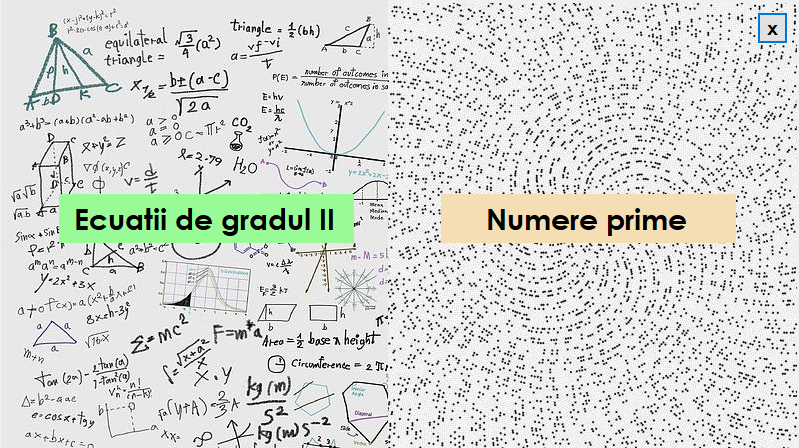
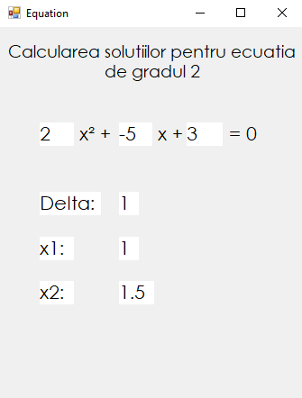

# Evaluare-Laborator V-II

## Meniul principal

## Calcularea tuturol numerelor prime, mai mici decat numarul introdus
  

## Calcularea solutiilor ecuatiiei de gradul II
   

## Mesajul afisat la inchiderea aplicatiei
  
